# Procesverslag
**Auteur:** Bodil Liesdek

## Bronnenlijst
1. -https://medium.com/@zac_heisey/7-alternatives-to-the-div-html-tag-7c888c7b5036-
2. -http://off-white.colorcode.is/-
3. -https://beautifytools.com/javascript-validator.php-
4. -https://jigsaw.w3.org/css-validator/validator-
5. -https://www.eggradients.com/shades-of-red-
6. -https://www.eggradients.com/shades-of-green-color-
7. -https://cssgradient.io/shades-of-blue/-
8. -https://www.crisp.nl/-
9. -https://developer.mozilla.org/en-US/docs/Web/CSS/linear-gradient()-
10. -https://developer.mozilla.org/en-US/docs/Web/CSS/max-width-
11. -https://css-tricks.com/snippets/css/complete-guide-grid/-
12. -https://css-tricks.com/snippets/css/a-guide-to-flexbox/-
13. -https://developer.mozilla.org/en-US/docs/Web/CSS/Pseudo-classes-
14. -https://www.w3schools.com/tags/ref_pxtoemconversion.asp-
15. -https://dlo.mijnhva.nl/d2l/le/content/286174/Home-

## Intake (week 1)
-uitwerken voor de kick-off werkgroep - begin van de eerste week-

**Je startniveau:** Blauw/Rood

**Je focus:** Responsive

**Je opdracht:** https://www.crisp.nl/

**Screenshot(s) van de eerste pagina (small screen):**

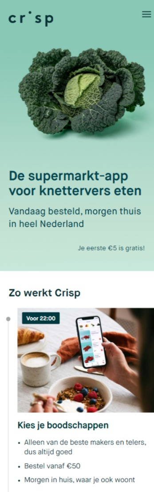

**Screenshot(s) van de tweede pagina (small screen):**

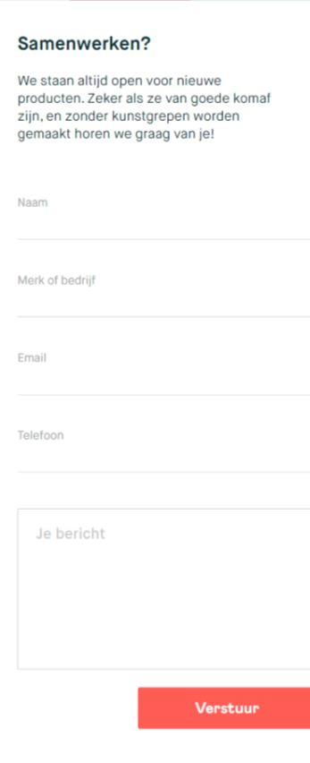

## Breakdownschets (week 1)

-uitwerken voor de 1e werkgroep - eind van de eerste week-

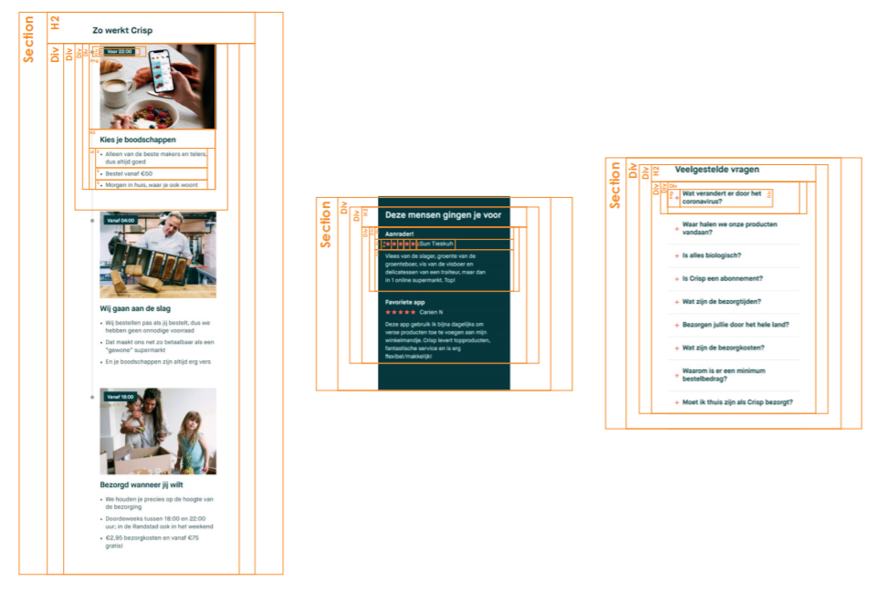
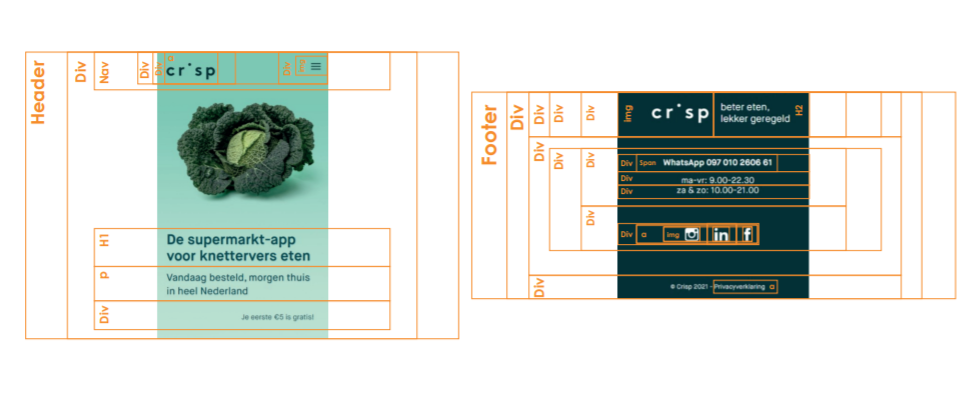

## Voortgang 1 (week 3)

Ik heb tot nu toe alle HTML van de eerste pagina geschreven. Dit ging heel erg soepel, vooral ook door die breakdown schetsen. Dus ik ben van plan dat ook te maken voor de tweede pagina.

Moeilijk:
Sommige iconen/afbeeldingen kon ik niet van de site zelf halen, dus die heb ik zelf moeten opzoeken. Alleen hebben die dan verschillende groottes. Wat is de beste manier om aan te pakken dat ze dezelfde groottes krijgen?

**Screenshot(s):**
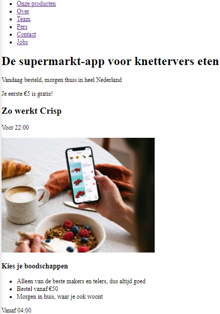
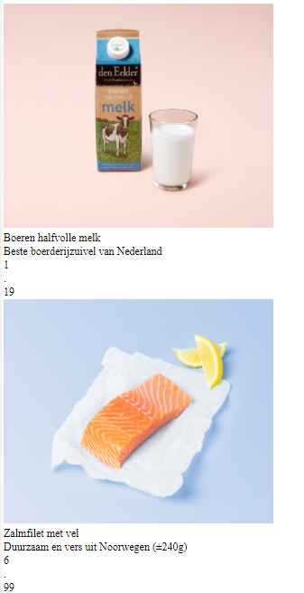

### Verslag van meeting

Alle div's veranderen in articles.

## Voortgang 2 (week 5)

Begonnen met de CSS. De header is gelukt, de standaard opmaak voor de rest van de pagina moet ook wel lukken.

Moeilijk:
Ik heb moeite met het hamburgermenu, de button in de header sticky maken (m.b.v. JS) en de lijn aan de linkerkant van de pagina.

**Screenshot(s):**
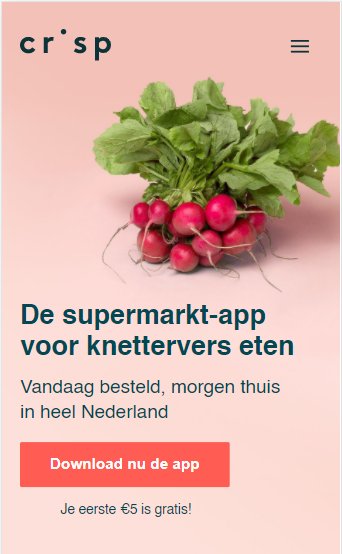
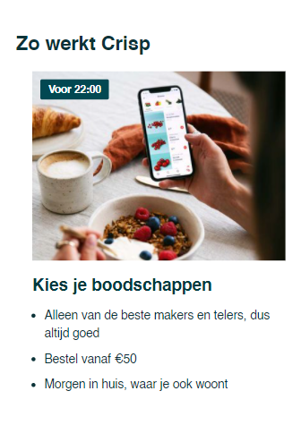

### Verslag van meeting
- css overzicht om class voor hamburger menu via Javascript "actief" te smaken
- liever alle div's vervangen door sections

## Voortgang 3 (week 6)
- Hulp met Javascript -> hamburger menu + veelgestelde vragen
- twee html pagina's linken aan een stylesheet?
- en voor javascript?
- Hulp met aansprekn van 'input' button form
- Moeten foutmeldingen erin verwerkt worden?
- Andere manier van elementen binnen een section, om meerdere articles te groeperen?

**Screenshot(s):**
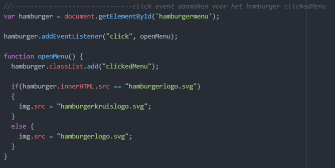
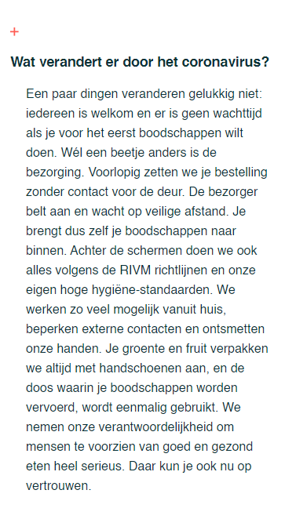
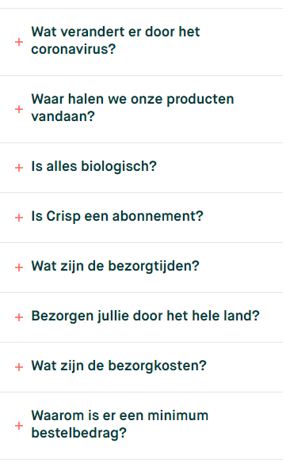
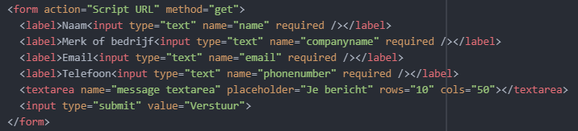
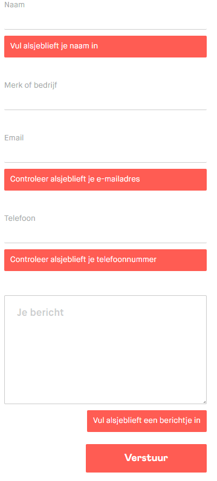

### Verslag van meeting
- Hulp met Javascript -> hamburger menu + veelgestelde vragen
-> Code is al goed, maar element opslaan in variabele (uiteindelijk hebben we hierover gebeld!)
- twee html pagina's linken aan een stylesheet?
-> je kan twee losse stylesheets gebruiken, maar je kan ook een html pagina een id geven en die specifieke styling in een #homepage section zetten.
- en voor javascript?
-> JS kan vanuit een sheet voor beide html pagina's gebruikt worden.
- Hulp met aanspreken van 'input' button form
-> attribute selector: input[type="submit"] {}
- Moeten foutmeldingen erin verwerkt worden?
-> Is niet verplicht, is een leuke extraatje. Maar HTML heeft native foutmeldingen.
- Andere manier van elementen binnen een section, om meerdere articles te groeperen?
-> Je mag het groeperen met een div'je omdat het geen semantische waarde heeft dan, maar wel minimaliseren in gebruik.

## Eindgesprek (week 7/8)

-dit ging goed & dit was lastig-

**Screenshot(s):**

-screenshot(s) van je eindresultaat-
