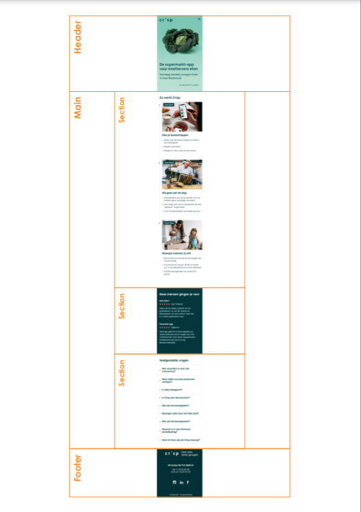

# Procesverslag
**Auteur:** Bodil Liesdek

Markdown cheat cheet: [Hulp bij het schrijven van Markdown](https://github.com/adam-p/markdown-here/wiki/Markdown-Cheatsheet). Nb. de standaardstructuur en de spartaanse opmaak zijn helemaal prima. Het gaat om de inhoud van je procesverslag. Besteedt de tijd voor pracht en praal aan je website.

## Bronnenlijst
1. -bron 1-
2. -bron 2-
3. -...-

## Intake (week 1)
-uitwerken voor de kick-off werkgroep - begin van de eerste week-

**Je startniveau:** Blauw/Rood

**Je focus:** Responsive

**Je opdracht:** https://www.crisp.nl/

**Screenshot(s) van de eerste pagina (small screen):**

**Screenshot(s) van de tweede pagina (small screen):**

## Breakdownschets (week 1)

-uitwerken voor de 1e werkgroep - eind van de eerste week-

## Voortgang 1 (week 3)

Ik heb tot nu toe alle HTML van de eerste pagina geschreven. Dit ging heel erg soepel, vooral ook door die breakdown schetsen. Dus ik ben van plan dat ook te maken voor de tweede pagina.

Moeilijk:
Sommige iconen/afbeeldingen kon ik niet van de site zelf halen, dus die heb ik zelf moeten opzoeken. Alleen hebben die dan verschillende groottes. Wat is de beste manier om aan te pakken dat ze dezelfde groottes krijgen?

**Screenshot(s):**

### Verslag van meeting

Alle div's veranderen in articles.

## Voortgang 2 (week 5)

Begonnen met de CSS. De header is gelukt, de standaard opmaak voor de rest van de pagina moet ook wel lukken.

Moeilijk:
Ik heb moeite met het hamburgermenu, de button in de header sticky maken (m.b.v. JS) en de lijn aan de linkerkant van de pagina.

**Screenshot(s):**

### Verslag van meeting

## Voortgang 3 (week 6)

**Screenshot(s):**

### Verslag van meeting

## Eindgesprek (week 7/8)

-dit ging goed & dit was lastig-

**Screenshot(s):**

-screenshot(s) van je eindresultaat-
